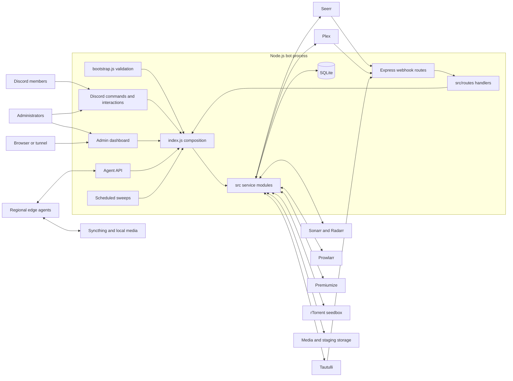
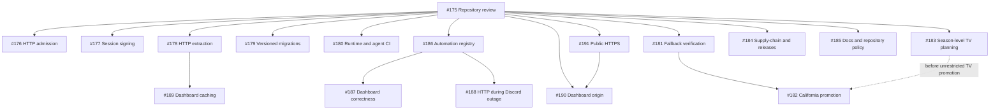

---
tags:
  - project/overseerr-dm-bot
  - graph
reviewed: 2026-08-16
source_commit: 1a803ac
---

# Project graph

This note joins the architectural map in [[Architecture]], the behavior in [[Core Workflows]], the
durable state in [[Data and Operations]], and the dated delivery plan in [[Backlog]].

## Runtime topology

## Current delivery graph

Solid arrows are explicit dependencies; grouped issues can otherwise proceed independently.

## Request and recovery pipeline

```mermaid
flowchart LR
    Request[Member request] --> Gate{Admin or trusted?}
    Gate -->|No| Pending[SQLite pending gate]
    Pending --> Approval[Discord or dashboard approval]
    Gate -->|Yes| SeerrRequest[Create attributed Seerr request]
    Approval --> SeerrRequest
    SeerrRequest --> Public[Public indexers through arr]
    Public -->|Found| Download[Download and import]
    Public -->|Nothing found| Escalation[Escalation watch]
    Escalation -->|Eligible or approved| AvistaZ[AvistaZ search]
    AvistaZ --> Seedbox[rTorrent seedbox]
    Seedbox --> Stage[rclone staging]
    Stage --> Import[Sonarr or Radarr import]
    Download --> Available[Plex availability]
    Import --> Available
    Available --> Notify[Requester and subscriber notices]
```

See [[Core Workflows]] for the conditions and safety gates behind these edges.
